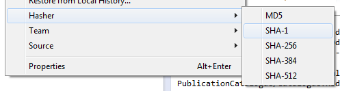
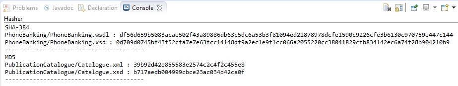

# eclipse-hasher

## AUTHOR
Geoffrey Fairchild
* [http://www.gfairchild.com/](http://www.gfairchild.com/)
* [https://github.com/gfairchild](https://github.com/gfairchild)
* [http://www.linkedin.com/in/gfairchild/](http://www.linkedin.com/in/gfairchild/)

## LICENSE
This software is licensed under the [BSD 3-Clause License](http://opensource.org/licenses/BSD-3-Clause). Please refer to the separate LICENSE.txt file for the exact text of the license. You are obligated to give attribution if you use this code.

## ABOUT
eclipse-hasher is an [Eclipse](http://www.eclipse.org/) plugin that generates the MD5, SHA-1, SHA-256, SHA-384, or SHA-512 hash of any selected files. It adds an option on the right click menu of any selected file or directory (e.g., in the Navigator or Package Explorer view) for generating hashes.

## REQUIREMENTS
Eclipse 4+ and Java 1.7 are required. Older versions of Eclipse may work, but they haven't been tested.

## INSTALL
eclipse-hasher is available through an Eclipse update site hosted on my personal website.

1. In Eclipse, go to Help -> Install New Software....
1. Click Add....
1. Add a repository named "Geoffrey Fairchild's Eclipse plugins" located at "http://www.gfairchild.com/eclipse/".
1. Check the box next to Hasher and click Next.
1. Click Next again to review the license, accept the license, and click Finish.
1. Click OK when presented with the security warning about unsigned content.
1. Restart Eclipse.

## USING THIS PLUGIN
Simply right-click a file or directory in a relevant view (such as Navigator or Package Explorer). Under the Hasher menu option, the available algorithms will be shown:

Select the desired algorithm, and the hash(es) will be computed and displayed:

